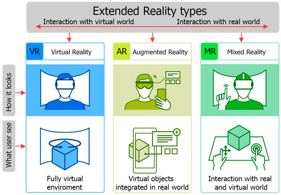

# Introduction to XR development

<figure><figcaption></figcaption></figure>

## Technology or Content?

When we start working in **Extended Reality (XR)**, a term that encompasses **Virtual Reality (VR)**, **Augmented Reality (AR)**, and **Mixed Reality (MR)**, we must distinguish between two main approaches: **technology** and **content**.

| **Technology**                         | **Content**                 |
| -------------------------------------- | --------------------------- |
| Real-time rendering techniques         | 2D, 3D, and animated assets |
| Spatial and binaural sound             | 360º video recordings       |
| Localization and tracking (e.g., SLAM) | GUI design                  |
| Input devices                          | Interaction design          |
| Physics and visual effects             | Narrative design            |

This separation reflects the **two primary roles** that often coexist in XR projects:

1. **Technological role:** Focused on programming, optimization, device integration, and hardware/software compatibility.
2. **Creative/content role:** Concerned with design, modeling, animation, storytelling, and user experience.

In professional teams, these two dimensions work together, as the _technology enables immersion_, and the _content delivers meaning and emotion_.
