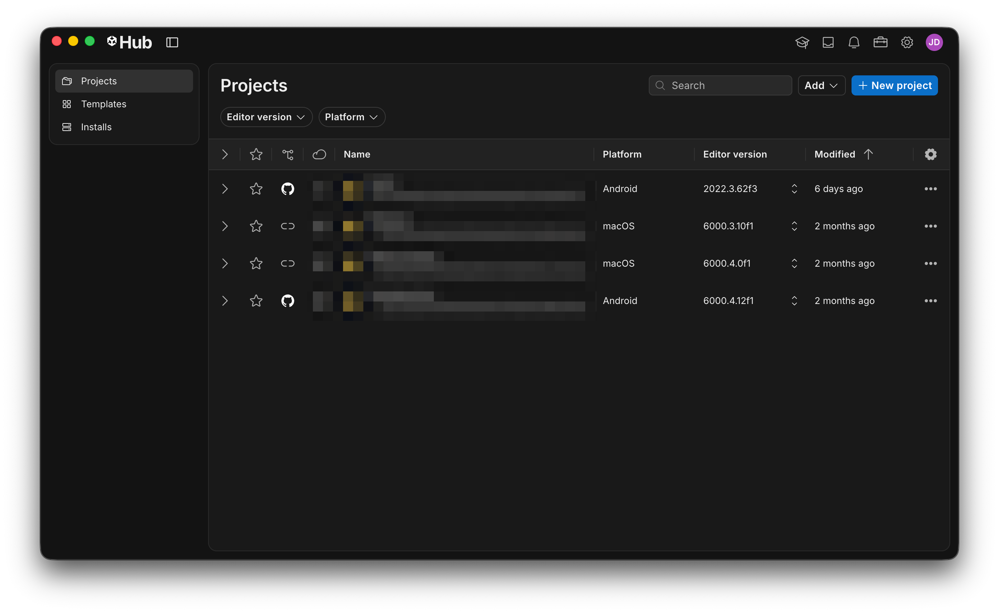

# Installing Unity

Unity is a **cross-platform development** tool. Initially conceived for video game development, it is currently used not only for this purpose, but also for:

* **AR and VR** experience development
* Simulation (e.g., remote assistance, aviation...)
* Architectural visualization
* Serious games and education
* ...

Cross-platform development allows for the reuse of code and various resources for deploying the same application on:

* Desktop (Windows/Mac/Linux)
* Mobile devices (iOS/Android...)
* SmartGlasses (Microsoft HoloLens/Vuzix/Magic Leap/Nreal...)
* Video game consoles (PS5/Nintendo Switch/Xbox...)
* Web


On occasions, for specific devices, it is necessary to install an additional plugin, such as, for example, to develop for Xreal glasses.

e.g., [https://docs.xreal.com/](https://docs.xreal.com/)

Usually, it is the device provider itself that offers its plugin for Unity.


## Installing Unity

Unity is a tool that is updated very frequently to keep up with the latest technological advances. The most common practice is to have different versions of Unity installed on our machine.

**Unity Hub** is the Unity version manager that we need to install in order to install any version of Unity (e.g., Archive, LTS...) as well as the templates it may offer us.


You will need to create an account in order to install the Unity Hub.




<figure><figcaption>
Unity Hub projects window.
</figcaption></figure>

## Version installation and modules

Inside the Unity Hub, we need to navigate to the "Installs" section and choose the Unity version to be installed:


For this course, we will be using the latest 6.X version, although some screenshots might differ between versions.


<figure><figcaption>
Selecting a Unity version to install.
</figcaption></figure>

Given that Unity allows cross-platform development, it is very likely that we, as developers, are not interested in developing for all platforms, but only for a few (e.g., Android and iOS).

After selecting a Unity version, since we are only interested in developing experiences for AR (mobile) and VR (Meta Quest), we only need the **Android module**:

<figure><figcaption>
Selecting the Android module for installation.
</figcaption></figure>

## IDE

Given that it is possible to write our own program logic via scripts/components using the C# programming language, it is essential to have an IDE installed on our machine that facilitates programming and exploitation of the tools and types that Unity offers us.

Unity offers the integrated installation of the [Visual Studio](https://visualstudio.microsoft.com/es/) IDE, however, there are other IDEs that we can use:

* [Visual Studio Code](https://code.visualstudio.com/)
* JetBrains Rider (using the [Toolbox](https://www.jetbrains.com/es-es/toolbox-app/))


We recommend using Rider, since it's free for non-commercial use and [educational purposes](https://www.jetbrains.com/academy/student-pack/).

