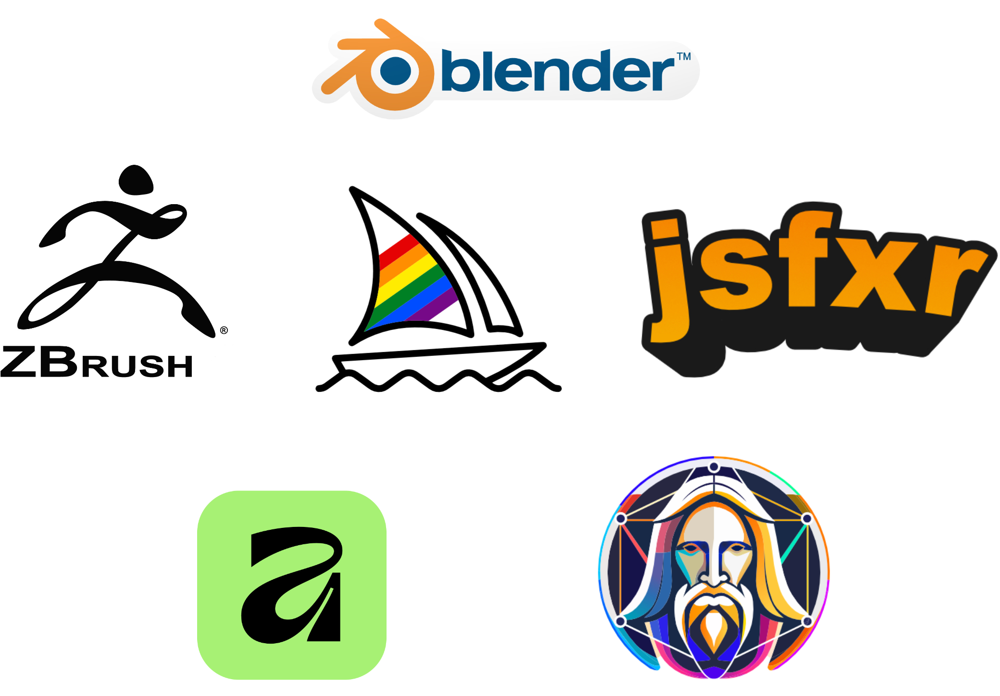
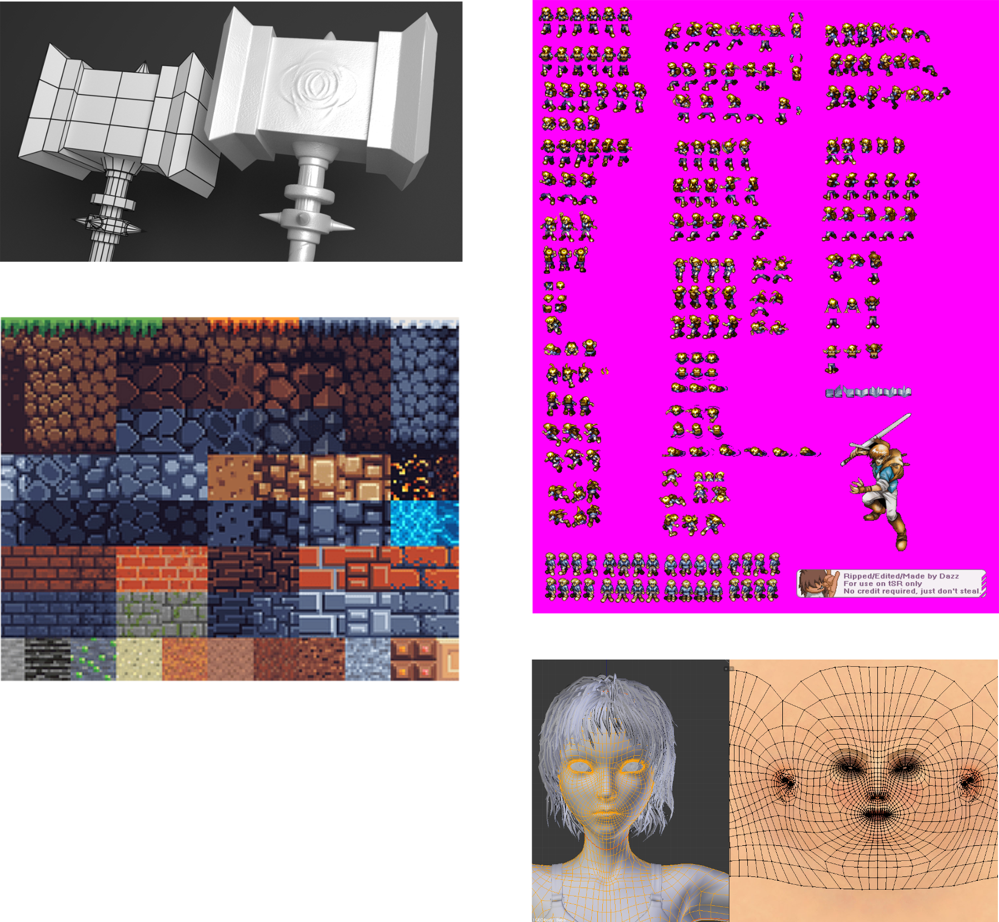
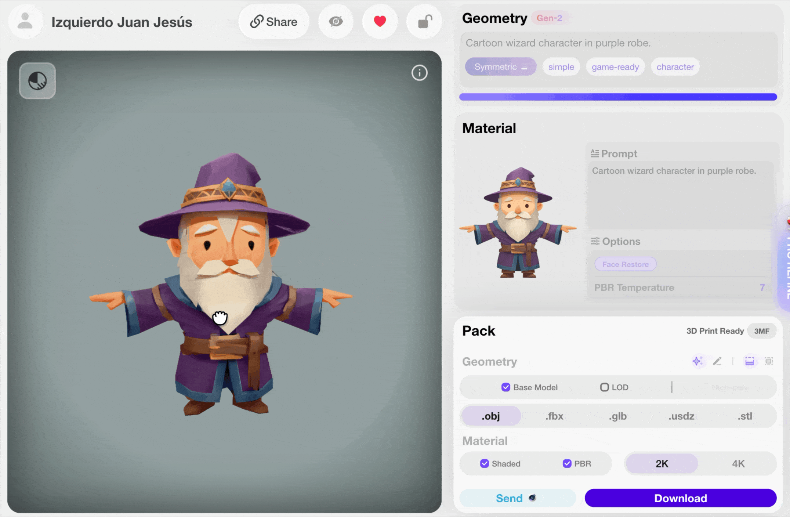
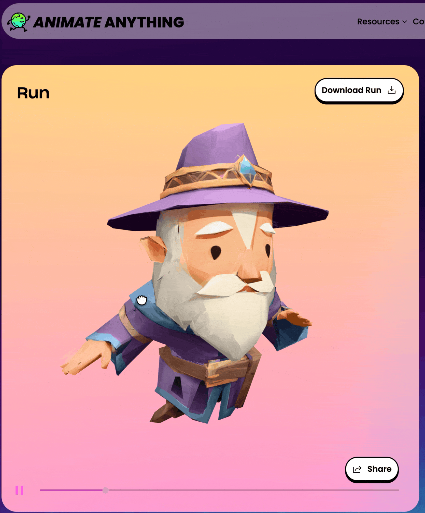

# Content Creation Tools

## Content Creation Tools

Before developing an XR application, it’s essential to prepare the **digital content**, such as 3D models, textures, audio, animations, and special effects.

A wide variety of software tools support these creative workflows:

#### 🎨 3D Modeling and Animation

* **Blender**: open-source 3D creation suite for modeling, sculpting, rigging, and rendering.
* **Autodesk 3DS Max** and **Maya**: industry-standard tools for professional animation and modeling pipelines.
* **ZBrush**: used for digital sculpting and high-resolution modeling.
* ...

#### 🧩 Texturing and Graphic Design

* **Adobe Photoshop**: texture editing, image retouching, and UI design.
* **Substance Painter / Designer**: for procedural materials and physically-based texturing.
* **Affinity**: image editing and common utilities.
* ...

#### 🔊 Sound and others

* [**JSFXR**](https://sfxr.me/): generates retro-style sound effects, ideal for quick prototypes.
* [**Rodin**](https://hyper3d.ai/workspace/rodin): supports procedural character or texture generation in creative contexts.
* [**Anything World**](https://app.anything.world/animation-rigging): enables 3D asset generation and animation with AI.
* **ChatGPT and AI tools**: now increasingly used for generating dialogue, names, or story elements.
* ...

<figure><figcaption>
Content creation tools
</figcaption></figure>

<figure><figcaption>
Example outputs
</figcaption></figure>

<figure><figcaption>
3D asset creation with Rodin
</figcaption></figure>

<figure><figcaption>
3D asset animation with Animate Anything
</figcaption></figure>
