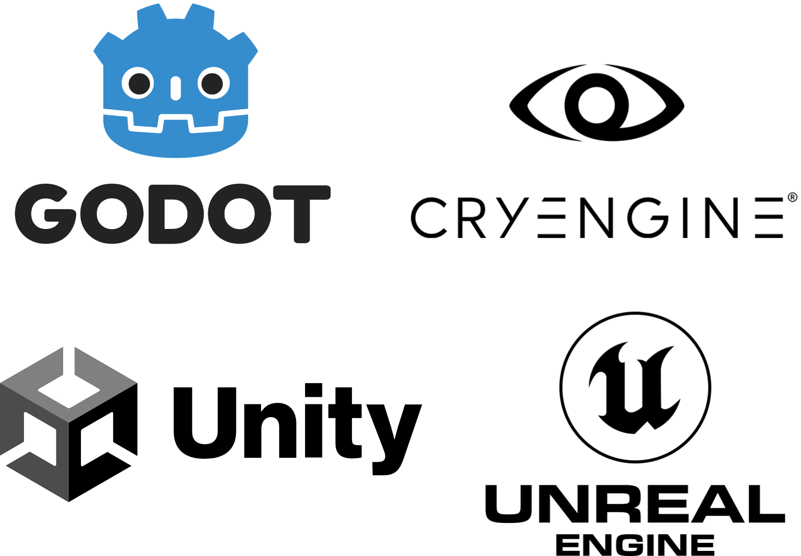

# Development Tools

## Development Tools

Once the assets are ready, we need a **development environment** capable of combining them into interactive experiences.

#### Core Engines

* 🕹 **Unity**: one of the most versatile and accessible engines for VR/AR/MR development.
* 🧱 **Unreal Engine**: widely used in AAA games and realistic visualization (photorealistic rendering).
* ⚙️ **Godot**: an open-source alternative with XR capabilities via plugins.
* 🌍 **CryEngine**: high-performance engine, known for its advanced physics and lighting.
* ...

<figure><figcaption>
Development tools
</figcaption></figure>

These tools handle **visualization, interaction, and real-time simulation**, forming the backbone of most XR applications.

> ⚠️ We will **focus on real development environments**, meaning those that require programming logic and scripting — _not simple authoring tools_ such as **BlippAR**, which allow AR experiences without coding but offer limited flexibility.
