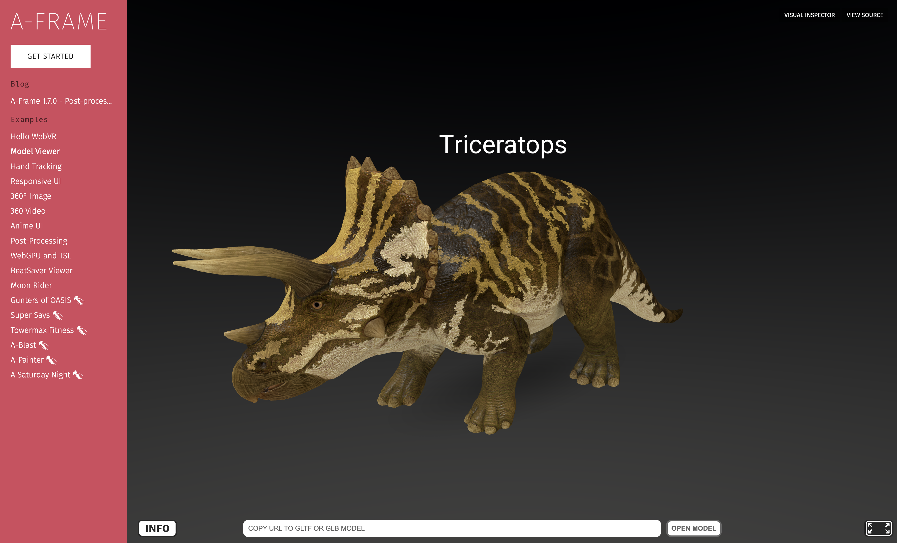

# 🌐 XR for the Web

**A-Frame** is a high-level framework that allows to execute VR and AR experiences directly in the browser.

This ecosystem enables developers to publish immersive experiences without users needing to install apps, making distribution easier.



<figure><figcaption></figcaption></figure>

***

**Niantic’s 8th Wall** leads the way for **WebAR**, enabling marker-based and markerless AR directly on mobile browsers.



<figure><figcaption>
AR Tracking with World AR (from 8th Wall)
</figcaption></figure>

***

Additional **WebAR frameworks** include:

* **AR.js**: lightweight library compatible with most mobile devices.
* **ARToolkit**: one of the earliest AR libraries, open source.
* **Argon.js**, **awe.js**, and **three.ar.js**: various JavaScript-based frameworks providing camera access, tracking, and rendering capabilities.

> Web-based AR represents the _democratization_ of XR: anyone can experience AR with nothing more than a smartphone browser.
