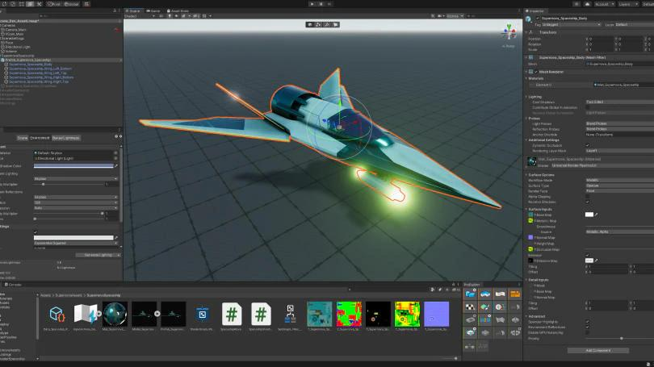
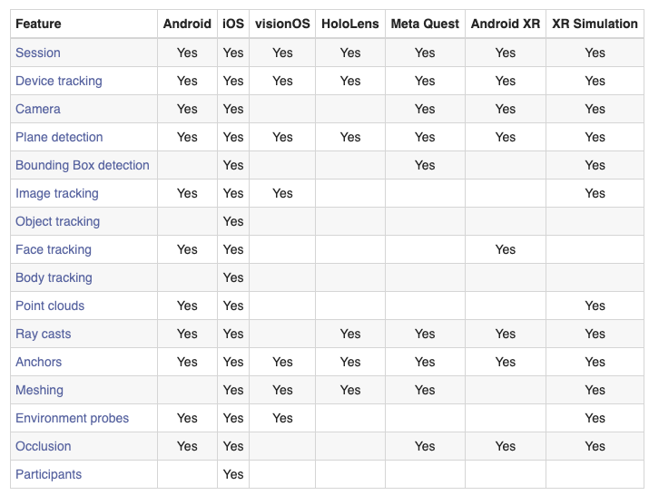

# Why unity?

Unity has become a cornerstone of XR development because it combines **ease of use**, **cross-platform deployment**, and **community support**.

**Key Advantages:**

* Compatible with [almost every system](https://docs.unity3d.com/6000.2/Documentation/Manual/PlatformSpecific.html): **consoles, mobile devices, smart glasses, and VR headsets**.
* A **massive** [**Asset Store**](https://assetstore.unity.com/) offers thousands of ready-to-use models, scripts, shaders, and plugins.
* Native support for **VR and AR** through the [**AR Foundation**](https://unity.com/unity/features/arfoundation) , [MARS](https://unity.com/products/unity-mars) (authoring system) and [**XR Interaction Toolkit**](https://docs.unity3d.com/Packages/com.unity.xr.interaction.toolkit@3.0/manual/index.html).
* According to Unity Technologies, **95% of VR/AR content** is developed using Unity.

Unity allows developers to manage all XR components (physics, rendering, UI, and input) within a single cohesive workflow.

<figure><figcaption></figcaption></figure>

## Unity for XR: Cross-Platform Development

Unity provides built-in packages for both **VR** and **AR** development under the same codebase.

The **AR Foundation** package abstracts device-specific implementations, allowing a single project to target multiple platforms such as iOS (ARKit), Android (ARCore), and HoloLens.





<figure><figcaption>
Feature table per platform
</figcaption></figure>
