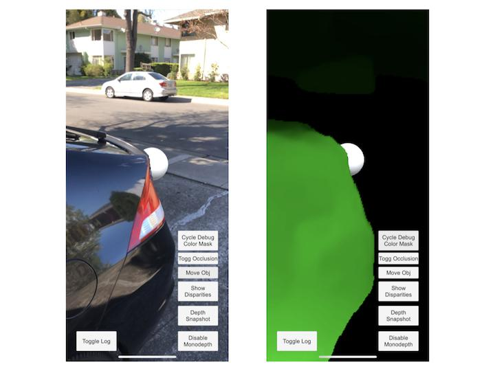

# Alternative tools

There are several other SDKs and tools worth exploring for specialized needs:

* [**ARToolkitX**](https://www.artoolkitx.org/): open-source pioneer in AR development.
* [**EasyAR**](https://www.easyar.com): lightweight, suitable for mobile AR.
* [**Kudan**](https://www.kudan.io): optimized for industrial applications.
* [**BITMAX**](https://bitmax.im/ENG/main/): supports environment tracking and spatial mapping.
* [**Immersal SDK**](https://developers.immersal.com/docs/): enables 3D mapping and localization for large environments.



* [**Motive.io**](https://www.motive.io/): a visual authoring tool for VR training scenarios.



* [**Niantic ARDK**](https://www.ar.dev/docs/ardk/index.html): Unity-compatible toolkit for advanced AR, including:
  * Image & surface detection
  * Depth & occlusion
  * Semantic segmentation (hands, people)
  * Meshing
  * Persistent and collaborative experiences via **AR Cloud**

<figure><figcaption></figcaption></figure>


