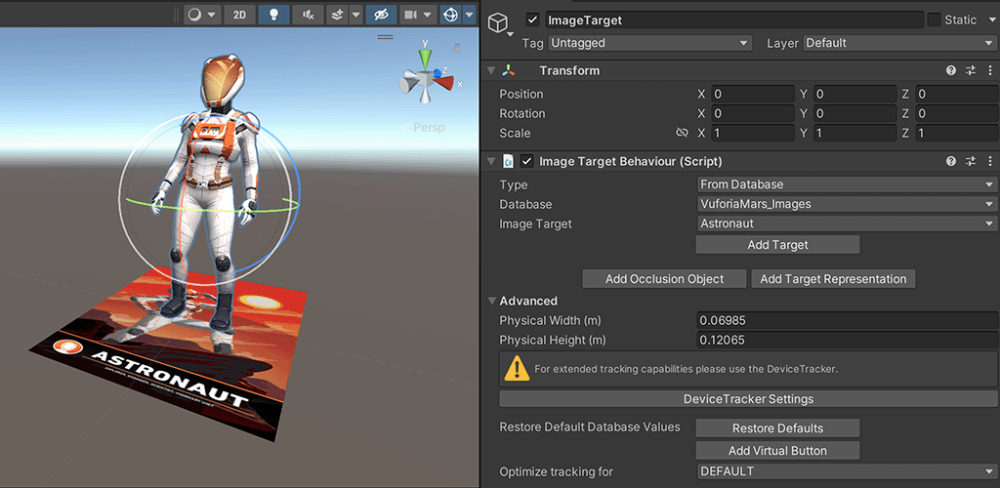
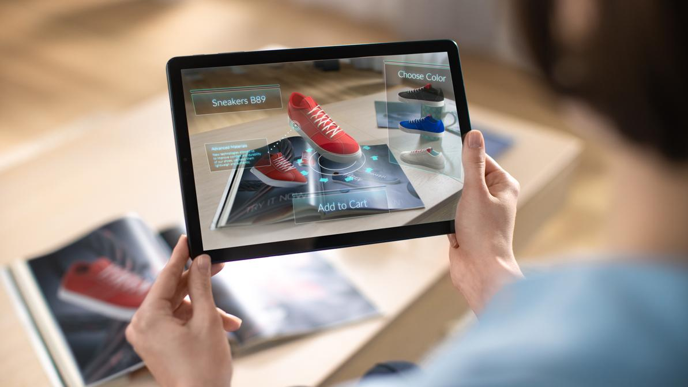
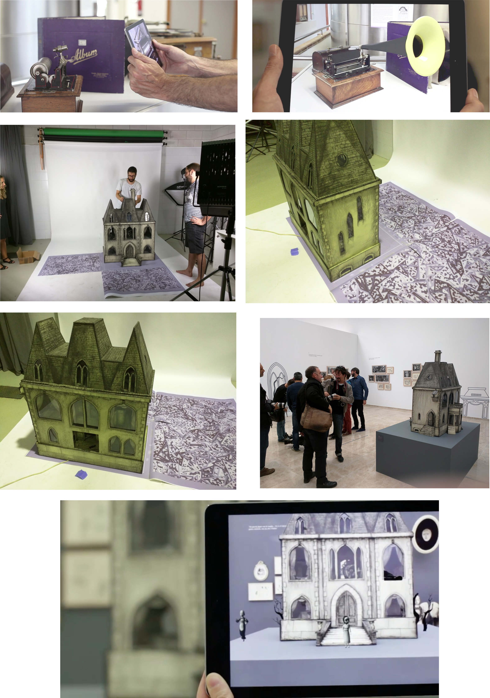

# Unity + Vuforia

**Vuforia**, developed by **PTC Inc.**, is one of the most widely used SDKs for creating AR experiences inside Unity.

It allows for fast setup and easy integration of marker-based AR through _image targets_, _3D objects_, or _spatial surfaces_.

<figure><figcaption></figcaption></figure>

**Vuforia** is an SDK for **iOS, Android, UWP**, and **Lumin**, designed to enable **Augmented Reality applications** using computer vision (CV) technologies.

It can:

* Recognize and track a wide variety of **physical targets**.
* Position and render **virtual objects** relative to real-world markers.
* Continuously **track the user’s perspective**, maintaining spatial coherence.

#### Supported Target Types

* Images (posters, cards, logos)
* Barcodes and QR codes
* Cylinders and boxes
* 3D Models and Objects
* Planes and Surfaces
* Complete environments

<figure><figcaption></figcaption></figure>

<figure><figcaption></figcaption></figure>



## Our experience with object recognition

<figure><figcaption></figcaption></figure>

